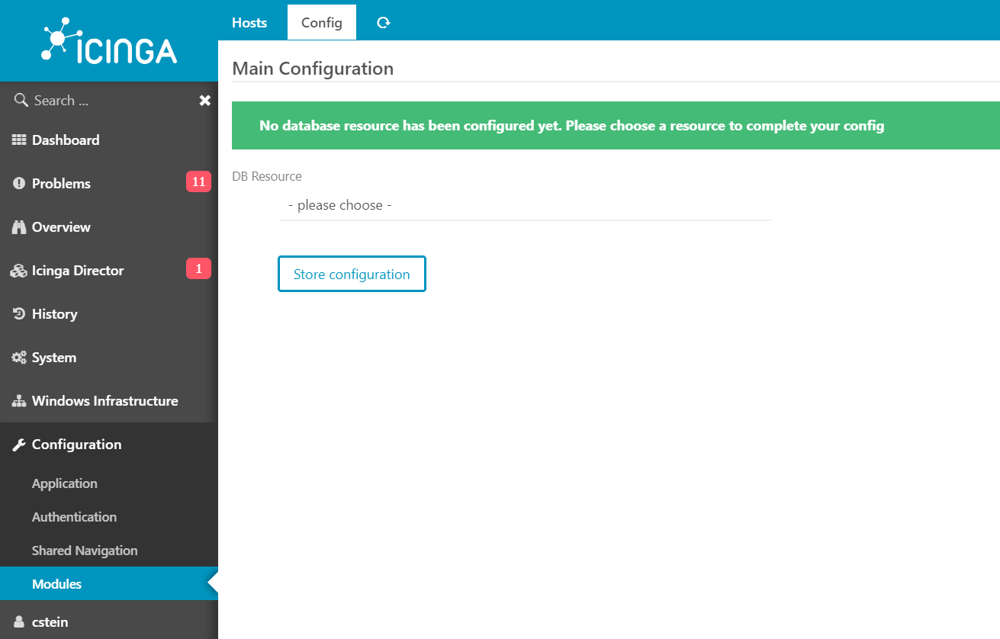

Installing the Icinga Web 2 Module
=====================================

Install the Module
-------------

To install the module, simply copy it into your Icinga Web 2 Module Directory, which is usually located at

```
    /usr/share/icingaweb2/modules/
```

The folder inside the modules directory has to be named

```
    windows
```

and all content of this repository have to be copied there. In case you are having multiple Icinga Web 2 instances, you will require to install the module within each of it.

Setup the Database (MySql / MariaDB)
-------------

The data of the Windows hosts are stored within a MySql / MariaDB database and therefor you will have to configure a database and ressource for this.

To setup the database, connect to your MySql / MariaDB database and create a new one (Note: Actual names, users and passwords can be changed of course):

```sql
    CREATE DATABASE icinga_windows;
```

Now setup a user, password and privilleges:

```sql
    GRANT ALL ON icinga_windows.* TO 'myuser'@'my_host' IDENTIFIED BY 'mypassword';
```

Now we can switch to our ressource configuration of Icinga Web 2 and create a new DB ressource

```
    Configuration > Application > Resources > Create a New Resource
```


**Note:** Please ensure that you set the **Character Set** of your database connection to

```
    utf8mb4
```

Enable and configure Module
-------------

Once copied into your modules directoy and the databse being setup included the Icinga Web 2 ressource, you are ready to configure the module itself. For this you will have to switch to

```
    Configuration > Modules > Windows
```

and press on the **Enable** button. After that you will be able to view the **Config** Tab, allowing you to select a database from the Icinga Web 2 ressource pool.



Select your previous created ressource and store your configuration. Once done, the Web Module will verify the correct schema and continue.

In case the schema is missing the module will prompt you for creating the schema with the **Create Schema** button.


**Note:** In case schema upgrades are required, there will be a **Apply a pending schema migration** button available.


Configuring Checks
-------------

To be able to configure modules for checking and the possibility to receive data, you will require the [Icinga PowerShell Module](https://github.com/LordHepipud/icinga-module-windows).

The Icinga Web 2 Module will provide the configuration for the PowerShell Modules, telling them on how often each checks are executed. Both modules ship with an automation to ensure that new / missing modules are automaticly added to the configuration. For this, you will have hosts to have successfully connected to your Icinga Web 2.

Once a host has established a connection, it will be listed under the Hosts view of the module within an disabled state. Once you approve the host by clicking on the approve status and confirm your action, the host will frequently contact Icinga Web 2 for the configuration.

During this process, available modules will be shipped from the PowerShell Module to Icinga Web 2 and being listed under the **Config** tab. There you can configure the check intervall for each module and enable / disable it.

To take these configuration to effect, you will have to click on Save once to store the configuration. Afterwards the PowerShell Module on the Windows hosts will start to work.